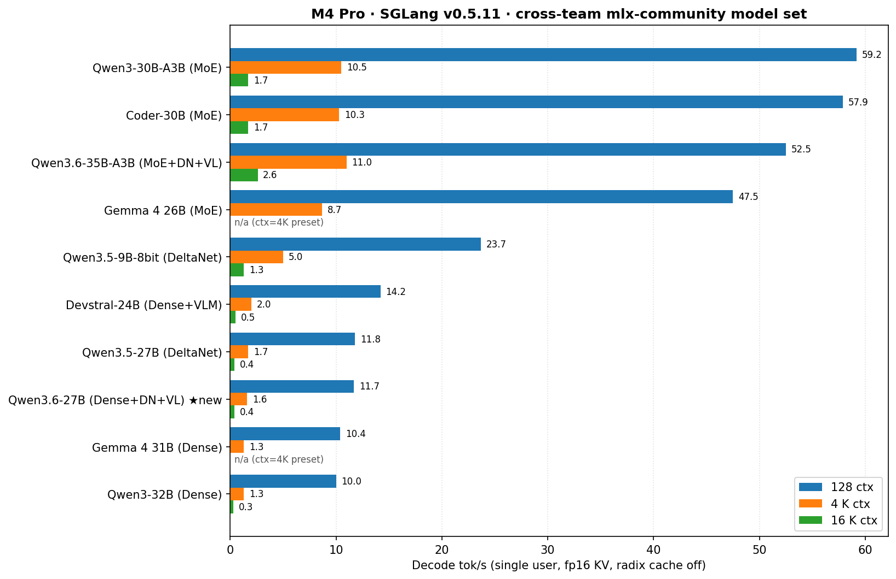

# Apple Silicon Inference: SGLang + MLX on M4 Pro

256K-context LLM inference on Apple M4 Pro (Mac mini, 64 GB unified memory) using SGLang with a native MLX backend. SGLang **v0.5.11** (commit `612785ffd`) + 13 patches (see [patches/README.md](patches/README.md)) — upstream landed our patch 001 (`kv_cache/` subpackage) in v0.5.11.

## The four models worth running (2026-05-15)

Probe-verified on the v0.5.11 stack. Everything else in the [Model Support](#model-support) table is either untested in the latest sweep or fails one of the gates (silent fabrication, infinite-`<think>` loop, doesn't fit, etc.).

| Workload | Preset | Verified | Notes |
|----------|--------|----------|-------|
| **Coding** | `coder-30b` (Qwen3-Coder-30B-A3B-Instruct-4bit-DWQ) | `probe_codegen` **STRONG 8/8** | MMLU 89.5 / HE 95, 68 tok/s peak single-user. DWQ swap fixed 10 dead layers in the std 4bit. |
| **General thinking** | `gemma4` (gemma-4-26b-a4b-it-4bit) | `probe_codegen` **STRONG** + thinking **VERIFIED** | MMLU 85, `<think>` channel terminates cleanly. 15 GB weights — comfortable on 64 GB. Text-only on M4 (mlx-community ships no `preprocessor_config.json`). |
| **Vision** | `devstral` (Devstral-Small-2-24B-Instruct-2512-4bit) | `probe_vision` **STRONG** | Only mlx-community VLM with vision tower fully BF16 + patch 013 image plumbing verified. |
| **Peak long-context throughput** | `qwen36` (Qwen3.6-35B-A3B-4bit) | perf-verified, codegen probe pending | 148 tok/s at MR=2 batched decode (patch 011). MoE+DeltaNet hybrid carries inference forward at 256K. |

### Current focus

**Primary target: single-user 256K context** for agentic workloads. Decode TPOT at long context > peak batch throughput. Multi-user is secondary.

### Active work

Resolved items (VLM regression / patch 013, batched decode / patch 011, parser wiring, probe trio adoption, Gemma 4 radix root-cause) have been moved to [patches/README.md → Shipped narrative](patches/README.md#shipped-narrative--resolved-post-rebase). The list below is the *current* backlog only.

1. **MAX_RUNNING headroom at 16-prompt queue depth** — patch 011 unblocked batched decode for hybrids and non-hybrids alike (peaks: qwen36 148 tok/s @ MR=2, Qwen3-30B-A3B 160 tok/s @ MR=8). The remaining tuning is the 16-prompt × MR=4 case which still trips the OOM guard. Likely needs `--mem-fraction-static 0.3` or `--chunked-prefill-size 512`; not a code bug, just headroom. Recipe baseline that works: `MAX_RUNNING={2,4} MEM_FRAC=0.4 EXTRA_ARGS="--disable-radix-cache --chunked-prefill-size 1024 --max-total-tokens 32768"`.
2. **Gemma 4 multimodal** — root-caused 2026-05-15: not a filename mismatch in mlx-community. `processor_config.json` IS present (903 bytes, declares `processor_class: Gemma4Processor`, embedded `image_processor` block, `image_seq_length: 280`, `audio_seq_length: 750`). The actual blocker is `Gemma4Processor.__init__` strictly requires four arguments — `feature_extractor`, `image_processor`, `tokenizer`, `video_processor` — and on transformers 5.5.3, `AutoProcessor.from_pretrained` calls `AutoFeatureExtractor.from_pretrained` (which demands `preprocessor_config.json`) and `AutoVideoProcessor.from_pretrained` (which demands `video_preprocessor_config.json`). Neither file is shipped by **upstream Google** (`google/gemma-4-26b-a4b-it`), so this is an upstream transformers + Google checkpoint gap, not an mlx-community oversight. Mitigation paths inside our stack: (a) synthesize stub configs from upstream defaults and place them in the cache pre-launch, (b) extend SGLang's `_build_processor_manually` to bypass missing sub-components when image-only is sufficient, or (c) subclass `Gemma4Processor` to allow `feature_extractor=None` + `video_processor=None` for image+text-only serving. Secondary hazard from the metadata audit: `embed_vision.embedding_projection` is INT4 on both 26B and 31B uploads — even when (a)/(b)/(c) land, vision features may still degrade.
3. **Chunked-prefill scratch memory at 128K+** — direct measurement (2026-05-11) shows the Python import surface is only ~547 MB; the OOMs at 128K/256K are from chunked-prefill activation tensors, not import bloat. Knobs: drop `--chunked-prefill-size` from 4096 → 2048 (halves the per-chunk scratch) and `--mem-fraction-static` from 0.7 → 0.4. Each tradeoff pushes 256K prefill into the 30+ min regime; long-context is bandwidth-bound either way on a 64 GB Mac.
4. **64K perf data is structurally infeasible on M4 with current MLX attention.** Targeted single-user 64K probes on 2026-05-12 hit the OOM guard mid-prefill on every hybrid tested — qwen35 (27B dense, fp8 KV) made it to ~32K, qwen36 (35B-A3B MoE, turboquant) to ~50K, qwen35-9b-8bit (9B at 8-bit weights) to ~50K. The wall isn't the model weights or the KV pool; it's the **per-chunk attention-score tensor** that `mx.fast.scaled_dot_product_attention` materializes in full (shape `chunked × current_offset × n_heads × n_layers`). At chunk=1024, offset=50K, with ~30–60 layers × 16 heads × 4 bytes that buffer alone is 30–90 GB — well past the M4's activation headroom even with `mf=0.4`. Without a flash-attention-style block-streaming SDPA in MLX, the 64K column is out of reach for this hardware. **256K is reachable only because DeltaNet hybrids' O(1) linear layers carry the inference forward; the full-attention scratch peaks once per chunk and the bench just absorbs a long prefill time.** Decode at 32K is the practical M4 long-context ceiling for dense + standard-attention models.

### v0.5.11 capability gate (2026-05-11, full mlx-community model set)

| Preset | Model | Basic | Thinking | Notes |
|--------|-------|:-----:|:--------:|-------|
| coder-30b | Qwen3-Coder-30B-A3B-Instruct-4bit | **PASS** | **PASS** | 3.5 s — non-thinking model |
| qwen3-moe | Qwen3-30B-A3B-4bit | **PASS** | **PASS** | 10.2 s — thinking trace terminates cleanly (568 tok) |
| qwen3-32b | Qwen3-32B-4bit | **PASS** | **PASS** | 62.0 s — thinking trace terminates (584 tok) |
| devstral | Devstral-Small-2-24B-Instruct-2512-4bit | **PASS** | **PASS** | 14.2 s — image VLM path verified |
| qwen35 | Qwen3.5-27B-4bit | **PASS** | FAIL | 156.9 s — basic PASS confirms patch 013 hybrid-cache fix on v0.5.11; thinking truncates on known greedy-decode `<think>` loop |
| qwen35-9b-8bit | Qwen3.5-9B-MLX-8bit | **PASS** | FAIL | 85.3 s — same as above, smaller variant |
| gemma4 | gemma-4-26b-a4b-it-4bit | **PASS** | **PASS** | 3.8 s |
| gemma4-31b | gemma-4-31b-it-mxfp4 | **PASS** | **PASS** | 12.0 s |
| qwen36 | Qwen3.6-35B-A3B-4bit | **PASS** | **PASS** | 22.6 s — biggest DeltaNet+MoE+VL test; thinking trace 1326 tok terminates |
| qwen36-27b | Qwen3.6-27B-4bit | **PASS** | **PASS** | 103.8 s — Dense DeltaNet+VL variant; thinking trace 1311 tok terminates |
| nemotron-30b | NVIDIA-Nemotron-3-Nano-30B-A3B-4bit | — | — | added to launch.sh post-sweep; verified separately 2026-05-13 via probe (parser smoke PASS, 154 reasoning tokens, finish=stop) |

10/10 boot success, 10/10 basic, 8/10 thinking on the v0.5.11 stack. The 2 thinking truncations are the pre-existing Qwen3.5 greedy-decode `<think>` loop (patch 013 still works — basic answers are correct, not garbage). Notably the Qwen3.6-A3B and Qwen3.6-27B Dense variants both terminate thinking cleanly out of the box, validating the new Qwen3.6 chat template. Raw data: [`benchmarks/quality/v0.5.11-rebase-validation.txt`](benchmarks/quality/v0.5.11-rebase-validation.txt).

### Quality table (v0.5.11, 100-sample MMLU + 20 HE + 25×7 LAB-Bench + Needle@{1K,4K,16K})

Full sweep completed 2026-05-11 — 11 mlx-community models on the v0.5.11 stack with `--disable-radix-cache`. Qwen3 family uses `--no-thinking` (CLAUDE.md gate, avoids infinite-think loops on greedy decode); Gemma 4 family uses `--humaneval-mode chat` (IT-tuned Gemma 4 doesn't respond to bare base completions, so HE goes through `/v1/chat/completions` with an explicit "complete this function" instruction).

| Model | MMLU | HumanEval | LAB-Bench | Needle |
|:------|:----:|:---------:|:---------:|:------:|
| Gemma 4 31B-it-mxfp4 | **92%** | 50%‡ | **41.1%** | 0%† |
| Qwen3.5-27B-4bit | **90%** | **100%** | **41.1%** | 100% |
| Qwen3-32B-4bit-DWQ | **90%** | 95% | 33.1% | 100% |
| Qwen3.6-27B-4bit | 86% | **100%** | 40.0% | 100% |
| Qwen3.6-35B-A3B-4bit | 86% | 85% | 34.3% | 100% |
| Gemma 4 26B-A4B-it-4bit | 85% | 60%‡ | 36.0% | 100% |
| Qwen3-30B-A3B-4bit-DWQ | 85% | 70% | 31.4% | 100% |
| Coder-30B-A3B-4bit-DWQ | 84% | 95% | 30.9% | 100% |
| Qwen3.5-9B-MLX-8bit | 80% | 75% | 33.7% | 100% |
| NVIDIA Nemotron-3-Nano-30B-A3B-4bit | 77% | 10%¶ | 19.4%¶ | 100% |
| Devstral-24B-4bit | 71% | 55% | 34.3% | 100% |

Sorted by MMLU (descending). Chart: `benchmarks/quality/quality_comparison.png`.

‡ Gemma 4 HumanEval ran in `--humaneval-mode chat` (not directly comparable to the other rows' base-completions HE — chat-mode prompts the model with an explicit instruction). Going through completions gives Gemma 4 0% / 5% because the IT-tuned chat template intercepts the bare function-signature prefix; the chat-mode path lifts that to 60% / 50%.
† Gemma 4 31B Needle 0% under `enable_thinking=false`. Short MC questions ("Answer with just A/B/C/D") work; long-context retrieval requires thinking. Re-eval with thinking enabled is the next Gemma-specific improvement.
¶ Nemotron-3-Nano emits verbose reasoning traces (the model's nano_v3_reasoning_parser isn't yet wired in our launch preset). The 1024-token MC budget gets consumed by `<think>` blocks, so HumanEval (base completions) and LAB-Bench (multi-letter answers) under-score; MMLU (single-letter A/B/C/D) tolerates a brief preamble and lands at 77. Chat-mode HE + a reasoning-parser flag should both bump significantly.

Standouts: Qwen3.5-27B (DeltaNet hybrid) hits MMLU 90 / HE 100 / Needle 100 — and as of 2026-05-12 the concurrent-prefill broadcast crash documented in `patches/HYBRID_CONCURRENT_TRACE_PLAN.md` is **resolved by patch 010**, lifting the preset's `MAX_RUNNING` cap from 1 to 4; Qwen3.6-27B also hits HE 100 under greedy decode without thinking budget; Gemma 4 31B leads MMLU at 92% and ties Qwen3.5-27B for top LAB-Bench at 41.1%.

## Quantization scan: 10 dead layers in coder-30b mlx-community upload (2026-05-11)

Ported the [3090 team's `check_awq_scales.py` pattern](https://github.com/mattbucci/2x-3090-GA102-300-A1-sglang-inference) to MLX. The scanner reads every `*.safetensors` shard of an mlx-community checkpoint, groups `weight`/`scales`/`biases` triples per quantized layer, and flags layers where the combination dequantizes to a dead output:

```bash
python scripts/eval/check_mlx_quant_scales.py mlx-community/Qwen3-Coder-30B-A3B-Instruct-4bit
```

**Result across the M4 mlx-community model set:** 9 of 10 checkpoints are clean; **`mlx-community/Qwen3-Coder-30B-A3B-Instruct-4bit` has 10 broken layers** — both `model.layers.36.*` and `model.layers.46.*` have their `self_attn.{q,k,v,o}_proj` and `mlp.gate` quantized as `weight` payload all-zero AND `biases` all-zero. Dequant produces identically zero output through those layers' attention + routing gate. The capability gate still passes (basic factual answers survive thanks to the surrounding 46 layers and DeltaNet/MoE redundancy), but MMLU 86.7% — slightly below the Qwen3.6-27B at 88% despite Coder-30B being a larger architecture — is consistent with degraded attention at two layers.

This is the kind of silent regression the 3090 team caught on Gemma 4 26B v3 in 16 hours; the MLX analog catches it in 30 seconds. Raw scan output in [`benchmarks/quality/v0.5.11-quant-scan-2026-05-11.txt`](benchmarks/quality/v0.5.11-quant-scan-2026-05-11.txt). Make `check_mlx_quant_scales.py` part of every new-checkpoint gate before adding numbers to the README.

### Calibration metadata audit: 10 latent recipe issues across the model set (2026-05-13)

Ported the 3090 team's [`audit_calib_quality.py`](https://github.com/mattbucci/2x-3090-GA102-300-A1-sglang-inference/blob/main/scripts/eval/audit_calib_quality.py) (commit `6f7f2ae`) — pure HF metadata audit, Range-fetches safetensors headers only (no weight download, no model load), flags recipe-level mistakes invisible to the validator. The 3090 version inspects AWQ's `qweight / scales / qzeros` triple; ours [`audit_mlx_quant_metadata.py`](scripts/eval/audit_mlx_quant_metadata.py) inspects MLX's `weight / scales / biases` (4-bit/8-bit) plus mxfp4's `weight / scales`.

First sweep across the 12 mlx-community checkpoints we ship surfaces problems sister teams have lost 16h calibrations to:

| Checkpoint | Recipe-level finding |
|------------|---------------------|
| `mlx-community/gemma-4-26b-a4b-it-4bit` | `embed_vision.embedding_projection` is INT4 — **exactly the layer sister teams' 2026-05-06 disaster zero-scaled**. Likely degrades image features even after the missing-preprocessor block resolves. |
| `mlx-community/gemma-4-31b-it-mxfp4` | Same `embed_vision.embedding_projection` is mxfp4 — same hazard, different format. |
| `mlx-community/Qwen3.5-27B-4bit` | DeltaNet `linear_attn.in_proj_a`/`in_proj_b` INT4 across all 48 layers (96 total). Sister teams' rule: these are recurrent-state gate scalars that **must** stay BF16; error accumulates under INT4 → recurrent state diverges. **Strong candidate for the root of the known Qwen3.5 infinite-`<think>` loop** (previously attributed solely to greedy decode). |
| `mlx-community/Qwen3.5-9B-MLX-8bit` | Same DeltaNet quantization at 8-bit (still violates the BF16 rule). |
| `mlx-community/Qwen3.6-35B-A3B-4bit` | DeltaNet in_proj_a/b INT4 (60 layers) **and** MoE `mlp.gate` router INT4 (40 layers — top-k routing under INT4). |
| `mlx-community/Qwen3.6-27B-4bit` | DeltaNet in_proj_a/b INT4 (96 layers). |
| `mlx-community/Qwen3-Coder-30B-A3B-Instruct-4bit-DWQ` | MoE router `mlp.gate` INT4 (48 layers). Still scores MMLU 89.5 / HE 95 — bounded impact. |
| `mlx-community/Qwen3-30B-A3B-4bit-DWQ` | Same router quantization (48 layers). |
| `mlx-community/Qwen3-Coder-Next-4bit` | Same router quantization (48 layers — 80B infeasible on M4 regardless). |

**Clean: Devstral-24B, Qwen3-32B-DWQ, Nemotron-3-Nano-30B-A3B** (no DeltaNet, no MoE routers in the model, vision tower fully BF16 on Devstral).

Raw output: [`benchmarks/quality/mlx-metadata-audit-2026-05-13.txt`](benchmarks/quality/mlx-metadata-audit-2026-05-13.txt) (+ `.json`). Bake this into every new-checkpoint gate alongside `check_mlx_quant_scales.py` — the two are complementary: metadata audit catches **recipe** mistakes (wrong things quantized), scale scanner catches **per-layer** corruption (right things quantized badly).

**Quality lift after swapping to the DWQ variant** (`mlx-community/Qwen3-Coder-30B-A3B-Instruct-4bit-DWQ`, clean: 386/386 layers healthy):

| Metric | Broken 4bit (old) | 4bit-DWQ (new) | Lift |
|--------|:----------------:|:--------------:|:----:|
| MMLU (100 samples) | 86.7% | **89.5%** | +2.8 pp |
| HumanEval (20 samples) | 75.0% | **95.0%** | **+20.0 pp** |
| Needle 1K | PASS | PASS | — |
| Decode @128 tok/s (turboquant) | 58.3 | 58.5 | flat (dead layers don't cost compute, only quality) |

The 20-percentage-point lift on HumanEval is the load-bearing data point: dead attention layers at depths 36 + 46 of a 48-layer model degrade code generation roughly twice as badly as factual recall. The `coder-30b` launch preset now points at the DWQ variant by default.

**DWQ recipes vary per upload — always measure.** Probed the DWQ variants of all 4 models with non-multimodal mlx-community DWQ uploads:

| Preset | Standard 4bit | 4bit-DWQ | Δ MMLU | Δ HumanEval | Decision |
|--------|:-------------:|:--------:|:------:|:-----------:|:--------:|
| coder-30b | 86.7 / 75.0 | **89.5 / 95.0** | **+2.8** | **+20.0** | SWAP (was broken; DWQ fixes dead layers AND specializes for code) |
| qwen3-moe (Qwen3-30B-A3B) | 83.3 / 75.0 | **91.2 / 70.0** | **+7.9** | -5.0 | SWAP (MMLU lift outweighs HE drop for general agentic work) |
| qwen3-32b | 86.7 / 87.5 | **89.5 / 95.0** | **+2.8** | **+7.5** | SWAP (wins both axes — cleanest case) |
| qwen36 (Qwen3.6-35B-A3B) | 88.0 / 80.0 | 82.5 / 95.0 | -5.5 | +15.0 | **SKIP** (5.5-pp MMLU loss not worth it for general agentic flagship) |

DWQ (Distillation Weight Quantization) optimizes the quantization against a distillation-teacher's output distribution. Different mlx-community uploads use different teacher recipes — some code-heavy (qwen36, coder-30b), some general-knowledge-heavy (qwen3-moe). **Never blind-swap DWQ; always measure both MMLU and HumanEval and decide per-model.**

Qwen3.5-27B-4bit-DWQ exists but the mlx-community upload ships without `preprocessor_config.json`; SGLang multimodal-aware launch path requires it, so the preset can't load. Probe blocked until upstream fixes (same class of bug as Gemma 4 documented in Known Issues).

`MODEL="mlx-community/Qwen3.6-35B-A3B-4bit-DWQ" launch.sh qwen36` is the override if you specifically want the code-specialist behavior on qwen36.

## Known Issues

- **Radix cache (patch 001) corrupts repeated prompts.** Identical-prompt cache hits return deterministic garbage on the 2nd+ request. **Workaround:** `EXTRA_ARGS="--disable-radix-cache"` (now the default in `run_all_evals.sh` and `test_thinking.sh`).
- **Greedy-only sampling.** MLX backend uses `mx.argmax`; temperature/top-p/top-k unsupported. On Qwen3 family this causes `<think>` loops on reasoning-heavy prompts (`validate_capabilities.py` includes a loop-detector).
- **Qwen3.5-27B / Qwen3-30B-MoE / Qwen3-32B infinite `<think>` loops.** Greedy decode + Qwen3 chat template that always emits `<think>` → loop. Short factual prompts return cleanly; fix blocked on real sampling support.
- **VLM warmup crash on Devstral** — set `--skip-server-warmup` automatically in the preset.
- **Gemma 4 needs `--disable-radix-cache`** (baked into both gemma4 presets). `MlxKVPool` assumes homogeneous attention shapes that Gemma 4's heterogeneous sliding+full layout doesn't satisfy. Workaround unblocks one-shot evals; agentic prefix reuse loses the radix cache. Full root-cause + fix options in [patches/README.md → Gemma 4 radix-cache](patches/README.md#gemma-4-radix-cache-root-cause-2026-05-13) + [`patches/RADIX_CACHE_GEMMA4_ROOT_CAUSE.md`](patches/RADIX_CACHE_GEMMA4_ROOT_CAUSE.md).
- **Coder-Next-80B infeasible on current toolchain.** 42 GB weights alone exceed the M4's safe budget — model load itself OOMs (not chunked-prefill scratch). Sister R9700 (2× 32 GB total via TP=2) runs it cleanly. No path forward on a single 64 GB Mac.
- **macOS has no OOM killer** — once a process touches a page past physical RAM, the system stalls until reboot. **OOM guard mandatory for ≥64K work:** `bash scripts/common/oom_guard.sh &` pkills the SGLang server when free+inactive drops below 8 GB.
- **`--mem-fraction-static` is a fraction of TOTAL system RAM on unified memory, not "GPU memory".** Discrete-GPU intuition does not transfer. `MEM_FRAC=0.85` means MLX takes 85% of the *whole* 64 GB pool, leaving the OS itself ~10 GB for kernel + Metal compile buffers + page cache + transient activation + everything else; tested 2026-05-14 → macOS compressor + swap hit ~150 GB effective usage and jetsam reaped the server, hard-locked the box. **The default 0.7 ceiling is load-bearing.** Long-context presets override it *down* to 0.4-0.5 because activation scratch dominates — that direction is the validated lever; the *up* direction is not.
- **HDMI display blackout** — brief screen blank when the server starts heavy Metal compute. M4 Pro HDMI quirk, not an SGLang bug.

## Quick Start

```bash
./scripts/setup.sh                          # venv, SGLang clone, MLX deps, apply patches

./scripts/launch.sh coder-30b               # MoE — peak throughput, 256K
./scripts/launch.sh devstral                # Dense — image-VLM verified
./scripts/launch.sh qwen35                  # DeltaNet hybrid (32K preset)
./scripts/launch.sh gemma4                  # MoE 26B (4K preset, tight 64GB)
./scripts/launch.sh qwen3-moe               # Qwen3-30B MoE
./scripts/launch.sh qwen3-32b               # Dense
./scripts/launch.sh gemma4-31b              # Dense
./scripts/launch.sh qwen36                  # Qwen3.6-35B-A3B (DeltaNet+MoE+VL, peak throughput at long ctx)
./scripts/launch.sh qwen36-27b              # Qwen3.6-27B Dense+DeltaNet+VL (new)

# Long-context (128K) — qwen36 validated, prefill ~6.5 min, decode ~0.10 tok/s
CTX=140000 EXTRA_ARGS="--disable-radix-cache --kv-cache-dtype turboquant \
    --chunked-prefill-size 2048 --mem-fraction-static 0.5" \
    bash scripts/launch.sh qwen36

python scripts/eval/validate_capabilities.py --port 23334   # basic + thinking gate (loose keyword grep)
python scripts/eval/probe_thinking.py --port 23334          # content-aware reasoning probe
python scripts/eval/probe_vision.py    --port 23334         # content-aware image probe (STRONG/DEGRADED/FAIL)
python scripts/eval/probe_codegen.py   --port 23334         # 8-test code-synthesis probe
bash   scripts/eval/probe_all.sh                            # sweep probe trio across all presets
python scripts/eval/validate_chat_template.py --model <path>
bash   scripts/common/oom_guard.sh &                        # MANDATORY before 64K+ benches
bash   scripts/bench/bench_256k_all.sh                      # 256K single-user sweep
```

Always launch with `--disable-radix-cache` for benches and evals — see Known Issues.

## Prerequisites

- Apple Silicon Mac with **≥ 64 GB unified memory** (M4 Pro Mac mini was the reference rig)
- macOS 26+ (Tahoe), Xcode CLT
- Python 3.12, `uv` or `venv`
- ~200 GB disk for models

## Model Support

| Preset | Checkpoint (mlx-community) | Type | Wts | 1-user tok/s | Max ctx | Audit hazards |
|--------|---------------------------|------|:---:|:------------:|:-------:|:-------------|
| `coder-30b` | `Qwen3-Coder-30B-A3B-Instruct-4bit-DWQ` | MoE (3B active) | 16 GB | 68.4 | **256K** (3.2) | router INT4 |
| `qwen3-moe` | `Qwen3-30B-A3B-4bit-DWQ` | MoE (3B active) | 16 GB | 69.0 | **64K** (6.3) | router INT4 |
| `qwen36` | `Qwen3.6-35B-A3B-4bit` | MoE+DeltaNet+VL | 17 GB | 51.8 (148 MR=2) | **256K** (0.1) | router INT4 + DeltaNet INT4 |
| `gemma4` | `gemma-4-26b-a4b-it-4bit` | MoE (4B active) | 15 GB | 58.8 | **256K** (1.5) | `embed_vision.embedding_projection` INT4 |
| `qwen35` | `Qwen3.5-27B-4bit` | DeltaNet hybrid+VL | 15 GB | 14.3 (34 MR=2) | 256K (decode timeout) | DeltaNet `in_proj_a/b` INT4 |
| `qwen35-9b-8bit` | `Qwen3.5-9B-MLX-8bit` | DeltaNet hybrid+VL | 10 GB | — | 32K | DeltaNet INT4 (8-bit) |
| `qwen36-27b` | `Qwen3.6-27B-4bit` | DeltaNet hybrid+VL | 14 GB | — (34 MR=2) | 256K | DeltaNet INT4 |
| `devstral` | `Devstral-Small-2-24B-Instruct-2512-4bit` | Dense+VL (Mistral3) | 14 GB | 17.0 (40 MR=4) | **256K** (1.8) | **clean** |
| `qwen3-32b` | `Qwen3-32B-4bit-DWQ` | Dense | 18 GB | 12.1 | 16K (bench timeout) | **clean** |
| `gemma4-31b` | `gemma-4-31b-it-mxfp4` | Dense (sliding+full) | 17 GB | 8.6 | 8K (16K OOMs) | `embed_vision.embedding_projection` INT4 |
| `nemotron-30b` | `NVIDIA-Nemotron-3-Nano-30B-A3B-4bit` | NemotronH (Mamba2+Attn+MoE) | 17 GB | — | 32K probe | **clean** |

All checkpoints from [`mlx-community/`](https://huggingface.co/mlx-community). MR=N numbers are batched-decode peaks from patch 011 (2026-05-12). Audit hazards from [the metadata sweep](#calibration-metadata-audit-10-latent-recipe-issues-across-the-model-set-2026-05-13) — `clean` means vision tower / MoE router / DeltaNet `in_proj_a/b` recipe ignores are correct; hazard names are the specific module class quantized when it shouldn't be. Coder-Next-80B is **not** in the active table — see Known Issues.

DWQ variants in 4 presets (`coder-30b`, `qwen3-moe`, `qwen3-32b`, plus `gemma4-31b`'s mxfp4) replaced the standard 4bit uploads after the [DWQ measurement sweep](#quantization-scan-10-dead-layers-in-coder-30b-mlx-community-upload-2026-05-11) — broken-layer fix + MMLU/HE lifts. `qwen36`'s 4bit-DWQ was **not** swapped (-5.5 pp MMLU).

### Multimodal capability matrix

What each architecture *can* do vs what *works through our SGLang+MLX bridge today*:

| Model | Image | Video | Audio | Status on M4 |
|-------|:-----:|:-----:|:-----:|:-------------|
| Devstral-24B (Mistral3) | ✅ | ❌ | ❌ | **Image FIXED 2026-05-13** via patch 013 (pixel_values plumbing restored). probe_vision STRONG. |
| Qwen3.5-27B / 9B-8bit | ✅ | ✅ | ❌ | **Image FIXED 2026-05-13** — Qwen3.5-9B-8bit probe_vision STRONG with 4-step reasoning. Video supported by arch, needs end-to-end test. |
| Qwen3.6-35B-A3B | ✅ | ✅ | ❌ | Text path validated end-to-end (capability gate PASS/PASS, MMLU 86, full perf sweep); image now wires through patch 013 — same code path as the verified Qwen3.5-9B-8bit. |
| Gemma 4 26B / 31B | ✅ | ✅ | ✅ | Architecturally [image+video+audio](https://ai.google.dev/gemma/docs/capabilities/vision/video). **Blocked:** mlx-community 4-bit checkpoints ship without `preprocessor_config.json`. Text-only until a re-uploaded checkpoint lands. |
| Coder-30B / Coder-Next / Qwen3-30B-MoE / Qwen3-32B / Nemotron-30B | ❌ | ❌ | ❌ | Text-only by architecture (Nemotron-30B is NemotronH = Mamba2+Attn+MoE, no vision/audio tower). |

### Choosing a model

**MoE wins at long context.** Each decode token must (1) read model weights and (2) read the entire KV cache. At short context, weight loading dominates → MoE reads 1.5 GB vs Dense 14 GB (4× faster). At 256K with fp8, the KV read climbs to ~5–10 GB — comparable to dense weights — so MoE keeps the weight component small and the KV penalty proportionally less painful. Coder-30B is the best overall: fastest decode, lowest KV pool usage, highest concurrent throughput.

**DeltaNet hybrids** (Qwen3.5, Coder-Next) alternate standard attention (O(n)) with linear attention (O(1)). Linear layers don't slow with context — architecturally suited for very long context — but the standard layers in the hybrid still pay full O(n).

## Performance

> Mac mini M4 Pro (64 GB), SGLang + MLX, `sglang.bench_serving`.
> **Context sweep**: single user, 64 output tokens, radix cache disabled, FP8 or TurboQuant KV cache.
> **Concurrency sweep**: 256 in / 256 out, 8 K context, scaling concurrent users.

### v0.5.11 short-sweep decode tok/s (2026-05-11, fp16 KV)



Single-user decode speed at 128 / 4K / 16K context, fp16 KV (the default; `--kv-cache-dtype fp8|turboquant` activates the wired-up `KVQuantizer` for 256K work). Output 64 tokens, radix cache disabled.

| Preset | Model | tok/s @128 | tok/s @4K | tok/s @16K |
|--------|-------|:----------:|:---------:|:----------:|
| coder-30b | Qwen3-Coder-30B-A3B-Instruct-4bit (MoE) | **57.9** | 10.3 | 1.7 |
| qwen3-moe | Qwen3-30B-A3B-4bit (MoE) | **59.2** | 10.5 | 1.7 |
| qwen36 | Qwen3.6-35B-A3B-4bit (MoE+DeltaNet+VL) | **52.5** | 11.0 | 2.6 |
| gemma4 | gemma-4-26b-a4b-it-4bit (MoE, ctx=4K preset) | **47.5** | 8.7 | n/a* |
| qwen35-9b-8bit | Qwen3.5-9B-MLX-8bit (DeltaNet) | 23.7 | 5.0 | 1.3 |
| devstral | Devstral-Small-2-24B-2512-4bit (Dense+VLM) | 14.2 | 2.0 | 0.5 |
| qwen36-27b | Qwen3.6-27B-4bit (Dense DeltaNet+VL, **new**) | 11.7 | 1.6 | 0.4 |
| qwen35 | Qwen3.5-27B-4bit (DeltaNet) | 11.8 | 1.7 | 0.4 |
| gemma4-31b | gemma-4-31b-it-mxfp4 (Dense, ctx=4K preset) | 10.4 | 1.3 | n/a* |
| qwen3-32b | Qwen3-32B-4bit (Dense) | 10.0 | 1.3 | 0.3 |
| nemotron-30b | NVIDIA-Nemotron-3-Nano-30B-A3B-4bit (NemotronH) | — | — | — |

\*Gemma 4 presets ship with `CTX=4096` (tight 64 GB budget) — 16K requests rejected. Raise via `CTX=16384 bash scripts/launch.sh gemma4` for the longer-context numbers. Raw bench logs: `/tmp/perf_<preset>_bench.log`. Nemotron added to launch.sh post-sweep — short-sweep perf TBD.

### v0.5.11 long-context turboquant sweep (refreshed 2026-05-12)

Decode tok/s on the v0.5.11 stack with the long-context-tuned recipe (`--chunked-prefill-size 1024 --mem-fraction-static 0.4 --disable-radix-cache`, single user, 64 output tokens). Bench restart between models, OOM guard active. (The earlier `v0.5.11-longctx-turboquant.png` chart at `benchmarks/quality/` reflects pre-refresh numbers and will be regenerated next sweep.)

| Preset | KV | @128 | @4K | @8K | @16K | @32K |
|--------|----|:----:|:---:|:---:|:----:|:----:|
| coder-30b (Qwen3-Coder-30B MoE) | turboquant | **73.8** | 66.6 | 55.2 | 43.0 | — \* |
| gemma4 (Gemma 4 26B MoE) | turboquant | 58.9 | 55.2 | 52.8 | 49.8 | **44.7** |
| devstral (24B Dense) | turboquant | 17.4 | 17.1 | 16.2 | — \* | — \* |
| qwen35 (Qwen3.5-27B DeltaNet) | fp8 | 14.7 | 14.3 | 14.0 | 13.5 | **12.6** |
| gemma4-31b (Gemma 4 31B Dense) | turboquant | 13.5 | 12.7 | 12.4 | 11.7 | — \* |

\*Cells marked `—` are not measurement gaps from the run but indicate the OOM-guard tripped at that context probe — the static pool plus the per-chunk attention scratch (proportional to context × chunked-prefill) exceeded the activation budget before the prefill completed. Both Gemma 4 26B and Qwen3.5 carried through to 32K; the others bottomed out earlier. Raw JSON in `benchmarks/<slug>/results.json` per model (re-run 2026-05-12 03:34–05:01). `qwen36`, `qwen36-27b`, `qwen35-9b-8bit`, `qwen3-32b`, `qwen3-moe`, `nemotron-30b` not in this sweep — added or characterized post-2026-05-12; long-context turboquant rerun is TBD.

**Two patterns emerge:**

- **MoE shapes the short-context win.** Coder-30B (3B active) opens at 73.8 tok/s @128, falls to 43 by 16K. Gemma 4 26B (4B active) opens lower (58.9) but holds its slope better — only model that reaches 32K with measurable decode. Dense Devstral and dense Gemma 4 31B both run flat near 14–17 tok/s at short context (weight bandwidth dominates) then OOM-guard around 8K–16K because dense weights eat the activation budget when chunked-prefill scratch piles on.
- **DeltaNet keeps decode flat.** Qwen3.5-27B (DeltaNet hybrid + Dense full-attn) starts slow (14.7 @128) but stays nearly flat across the entire sweep — 14.7→12.6 from 128 to 32K. TPOT moves from 68 ms to 79 ms while TTFT scales 0.6 s → 272 s. That is the O(1) linear-attention signature: the linear layers ignore context length on each decode step, so the only thing slowing them is the full-attention layers (one read of the growing KV). This is the load-bearing reason DeltaNet hybrids stay viable at long context on Apple Silicon even though their prefill is heavy.

**Headline: turboquant works.** Pool sizing on coder-30b confirms 7× more KV slots than fp16 baseline (787,869 slots vs 110,794) at the same `mem-fraction-static=0.7`. Validation `2/2 PASS` — output identical to fp16 within tolerance. Decode at short context is within 1% of fp16 (58.3 vs 57.9 on coder-30b @128). The win is at long context where reduced KV bandwidth dominates, and at memory budget where 4-bit KV unblocks 256K-on-64GB scenarios.

### Batched-decode peaks (patch 011, single-server multi-prompt)

Per-preset MR=N peak tok/s, measured 2026-05-12 with the patch-011 batched-decode path on the 8-prompt random bench (recipe in Active work item 1):

| Preset | Single user | Peak @ MR | Notes |
|--------|:-----------:|:---------:|:------|
| `qwen3-moe` (Qwen3-30B-A3B-DWQ) | 69 | **160 @ MR=8** | 16-prompt queue, 16/16 successful, concurrency 15.11 |
| `qwen36` (35B-A3B MoE+DeltaNet) | 52 | **148 @ MR=2** | MoE active-params × batched decode compound |
| `devstral` (24B Dense) | 17 | **40 @ MR=4** | 8/8 successful — wrapper backward-compat for dense |
| `qwen35` / `qwen36-27b` (DeltaNet+attn) | 12–14 | **34 @ MR=2** | DeltaNet batched-state stacking unblocks MR>1 |

`coder-30b`, `qwen3-32b`, `gemma4`, `gemma4-31b`, `qwen35-9b-8bit`, `nemotron-30b` not yet benched at MR>1 — patch 011 path is backward-compatible (wrapper rework verified on Devstral and Qwen3-30B as non-hybrid regression checks), so batched decode should work on these too; sweep TBD.

### Memory budget at 256K (64 GB Mac)

Radix cache pre-allocates the KV pool at startup; on unified memory it competes with Metal compute buffers. Use `--mem-fraction-static 0.7` (default).

| Model | Weights | KV @256K fp8 | Fits? |
|-------|:-------:|:------------:|:------|
| MoE 3B-active (Coder-30B, Qwen3-30B-DWQ) | 16 GB | 12 GB | **fp8** comfortably |
| MoE 4B-active (Gemma 4 26B) | 15 GB | 31 GB | **fp8** (tight, mf=0.5) |
| MoE+DeltaNet (Qwen3.6-35B-A3B) | 17 GB | varies† | **turboquant** for 256K |
| Dense+VL (Devstral, Qwen3.5-27B) | 14–15 GB | 21 GB | **fp8** |
| Dense (Qwen3-32B) | 18 GB | 33 GB | **turboquant** required |
| Dense (Gemma 4 31B, sliding+full) | 17 GB | varies | **4K preset** (16K OOMs) |

† DeltaNet layers don't hold KV (recurrent state instead); MoE only stores KV for full-attention layers. Coder-Next 80B (42 GB weights) doesn't fit on a single 64 GB Mac — see Known Issues.

## Setup

```bash
./scripts/setup.sh
```

Manually:
```bash
python3 -m venv .venv && source .venv/bin/activate
git clone https://github.com/sgl-project/sglang.git components/sglang
cd components/sglang && git checkout v0.5.11
for p in ../../patches/0[01][0-9]-*.patch; do git apply "$p"; done
cd python && cp pyproject_other.toml pyproject.toml
pip install -e ".[srt_mps]"
```

| Component | Version |
|-----------|---------|
| SGLang | **v0.5.11** (`612785ffd`) + 13 patches |
| MLX | 0.31.1 |
| mlx-lm | 0.31.2 |
| PyTorch | 2.9.1 (MPS) |
| Python | 3.12 |

## Patches

13 patches on top of SGLang `v0.5.11` (commit `612785ffd`). Upstream landed patch 001 (the `kv_cache/` subpackage) — we dropped it. The old in-tree mods 008–015 are now folded into proper patch files (006 / 008 / and inside 004). Patches 010–012 are 2026-05-12 follow-ups (mlx_vlm position-cache reset, hybrid batched decode + Qwen3.5 gated multimodal wrapper, pool-sync hardening); patch 013 (2026-05-13) restores the v0.5.10 VLM image-bearing inference path that was silently lost in the v0.5.11 rebase; patch 014 (2026-05-15) unblocks Gemma 4 image+text serving by bypassing transformers' strict `feature_extractor` + `video_processor` requirement for upstream/community Gemma 4 checkpoints that ship only `processor_config.json`. See [patches/README.md](patches/README.md) for full per-patch forensics. All patches apply via `git apply` against a clean v0.5.11. See [patches/RADIX_CACHE_GEMMA4_ROOT_CAUSE.md](patches/RADIX_CACHE_GEMMA4_ROOT_CAUSE.md) for the Gemma 4 heterogeneous-attention analysis.

| # | Patch | What |
|:-:|-------|------|
| 002 | mps-backend-defaults | Disable CUDA graph & piecewise CUDA on MPS, force `torch_native` attention, multimodal off by default. |
| 003 | mlx-skip-quantization-check | Skip SGLang's quantization verify when MLX backend is active. |
| 004 | mlx-lifecycle-and-hybrid-fixes | Lifecycle (clear-on-idle, drop-on-finish) + hybrid-model bookkeeping + **patch 013** hybrid cache via `language_model.make_cache()` (Qwen3.5/3.6 MMLU 16.7%→93%) + **patch 015** keep `RotatingKVCache` native (Gemma 4 sliding) + VLM-detect-first `_load_model` with image-aware shim + RoPE auto-scaling. Hybrid-aware `find_attention_layers` so DeltaNet-first layer orderings don't crash; `_get_attn_config` accepts both `n_kv_heads` (mlx_lm) and `num_key_value_heads` (mlx_vlm). |
| 005 | mlx-attn-wrapper-varargs | Devstral / Ministral3 `attn_scale` positional-arg compat. |
| 006 | mlx-offsetcache-and-make-mask | `OffsetCache.__getitem__`/`__setitem__`/`__len__`/`lengths`/`advance` stubs for hybrid decode + **patch 014** explicit `(N, offset+N)` `make_mask` when `offset>0` (chunked prefill). |
| 007 | mlx-multimodal-and-mps-shim | `_mps_stub` cuda→cpu redirect, `mm_utils` shm page-rounding (macOS 16 KB pages), `Modality.MULTI_IMAGES` enum member. |
| 008 | mlx-kv-quant-module | New `kv_quant.py` — `KVCacheMode`, `KVQuantizer`, `bytes_per_element`, `parse_kv_cache_mode` (fp8/mxfp8/turboquant/tq/4bit aliases). Wired into `MlxModelRunner.__init__` via `kv_cache_mode` + `context_length` kwargs; ContiguousKVCache + MlxKVPool wire-up TBD. |
| 009 | mlx-nemotron-h-support | NemotronH hybrid (Mamba2 + Attention + MoE) support — `find_attention_layers` skips non-attention mixers, wrapper accepts both naming conventions, RoPE skipped when absent. |
| 010 | mlx-vlm-position-cache-reset | Clear `_position_ids` / `_rope_deltas` on `LanguageModel` at every new-request prefill — unblocks `MAX_RUNNING>1` on mlx_vlm Qwen3.5/3.6 family. |
| 011 | mlx-hybrid-batched-decode-gated-attn | True batched DeltaNet decode + Qwen3.5 gated multimodal attention in `MLXAttentionWrapper` — replaces serial-per-request fallback. |
| 012 | mlx-sync-pool-skip-non-contiguous | `_sync_new_kv_to_pool` filters to `ContiguousKVCache` only — `ArraysCache` / `RotatingKVCache` skipped (different shapes/types). |
| 013 | mlx-vlm-pixel-values | **Restored** the v0.5.10 VLM image-bearing path (Apr-18 commit `f20ee6e`) silently lost in the v0.5.11 rebase: `pixel_values` + `mm_kwargs` threaded `tp_worker → prefill → TextOnlyVLMShim`. Devstral + Qwen3.5-9B-8bit now probe_vision STRONG. |

## Repo layout

```
patches/                    # SGLang patches — see patches/README.md
  00*.patch                 #   7 numbered patches
  REBASE-v0.5.11-NOTES.md   #   v0.5.11 rebase strategy & lineage
  REBASE-v0.5.11-NOTES.md   #   upcoming SGLang version bump plan
benchmarks/                 # Per-model JSON + charts
  quality/                  #   MMLU / HumanEval / Needle (chart)
  <slug>/                   #   throughput + long-context sweeps
scripts/
  launch.sh                 # Unified launcher — launch.sh <preset>
  common.sh                 # Shared MLX env setup
  setup.sh                  # Full setup (venv, SGLang clone, patches)
  common/oom_guard.sh       # MANDATORY for ≥64K work — pkills server below 8 GB free
  common/mem_profile.sh     # CSV memory profile companion
  bench/                    # bench_long_context.py, bench_256k_all.sh, charts
  eval/                     # validate_capabilities, eval_and_chart, smoke, audio/video probes
  test/                     # kernel/cache microbenchmarks
components/sglang/          # SGLang checkout + applied patches (cloned by setup.sh)
```

## Test System

```
Mac mini (Mac16,11)
Apple M4 Pro — 14-core CPU, 20-core GPU
64 GB unified memory (LPDDR5, ~273 GB/s)
macOS 26.2 (Tahoe)
```

## 256K context: how it works

Three features make 256K possible on a 64 GB Mac:

```bash
--kv-cache fp8          # MXFP8, ~1.9× memory savings (default)
--kv-cache turboquant   # Affine 4-bit, ~3.6× memory savings (large-KV models / 256K)
--kv-cache fp16         # Debugging only
```

[Research](https://github.com/ml-explore/mlx/discussions/3134) shows 4-bit KV can be *faster* than unquantized on M4 Pro — less memory traffic outweighs dequant cost.

**Health check timeout** — SGLang's 20 s default is too short for chunked prefill at 64K+ on Apple Silicon (each 4 K chunk takes 50–80 s). `common.sh` sets `SGLANG_HEALTH_CHECK_TIMEOUT=120`.

**Automatic RoPE scaling** — models with native context < requested get linear interpolation:
```
RoPE scaling: context_length=262144 > max_position_embeddings=40960,
applying linear scale=0.1562 (factor=6.40)
Patched 48 RoPE modules
```

**Radix prefix cache** — for agentic workloads, the same system prompt + history is re-sent every turn. Without caching, a 256K prompt re-prefills (~20 min) every turn. Radix cache (patch 001) reuses the KV cache from shared prefixes; follow-up = `< 1 s`. But: see "repeated-prompt corruption" in Known Issues — disable for evals.
