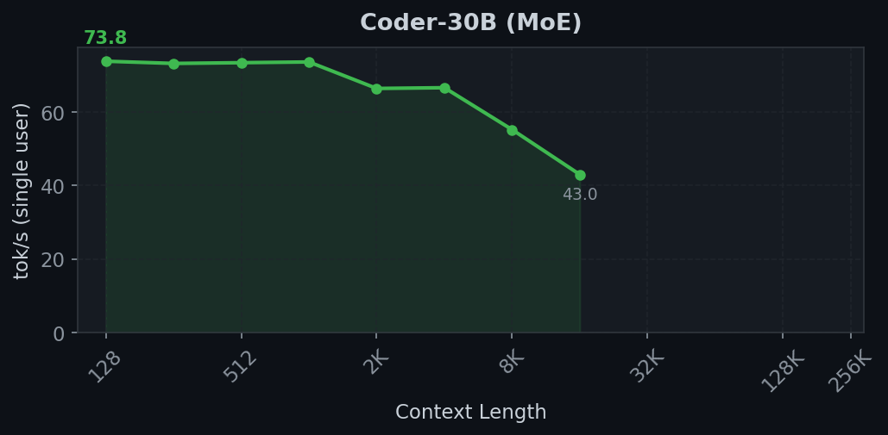
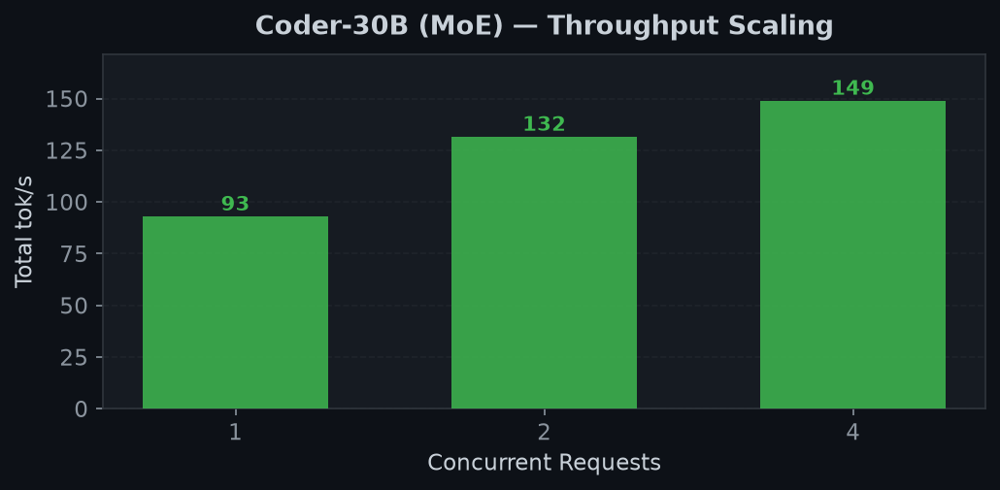
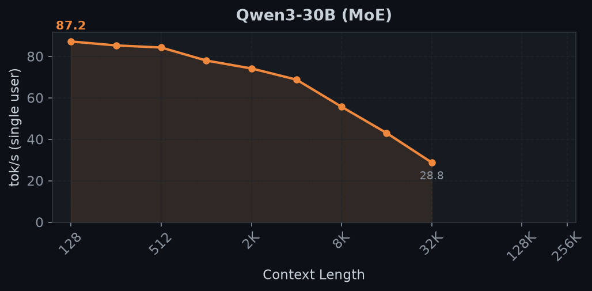
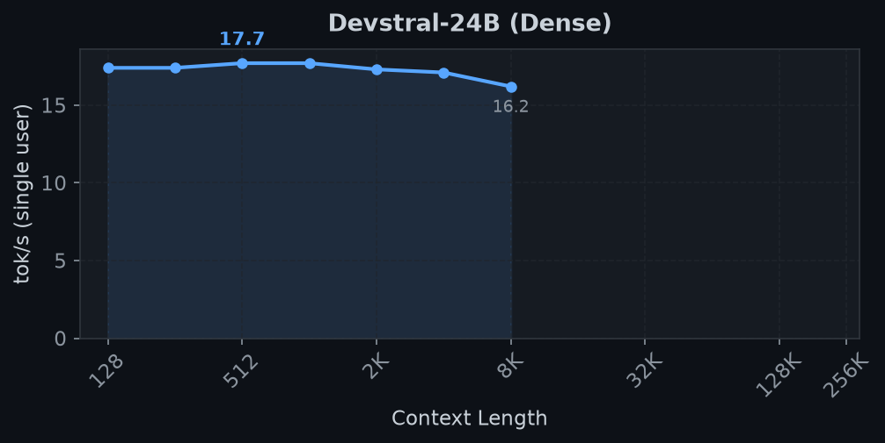
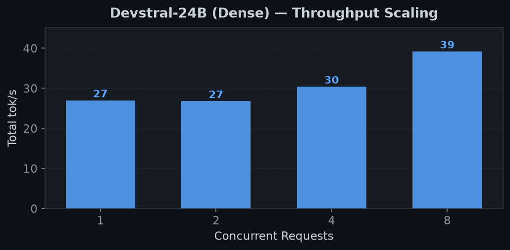
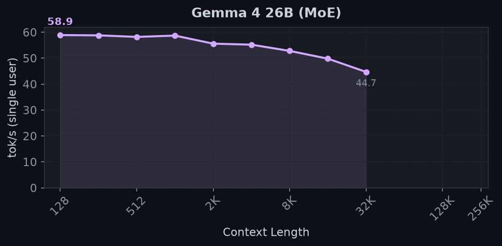
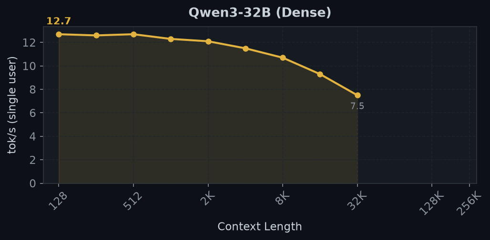
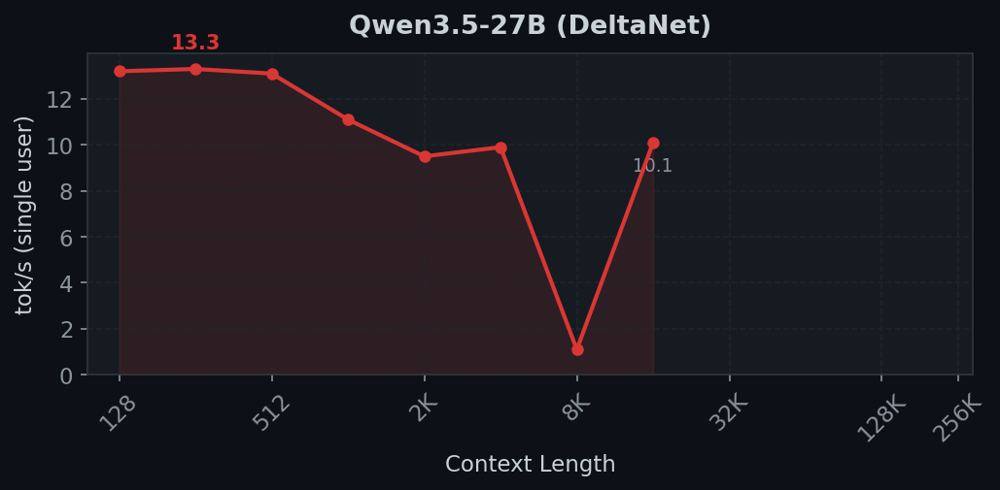
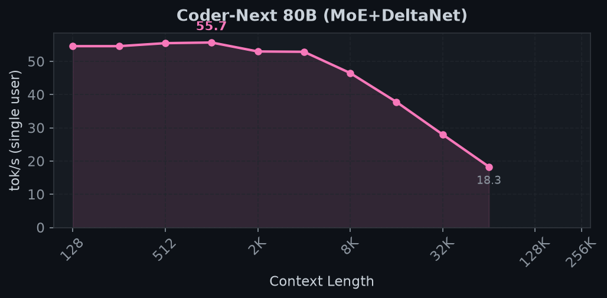
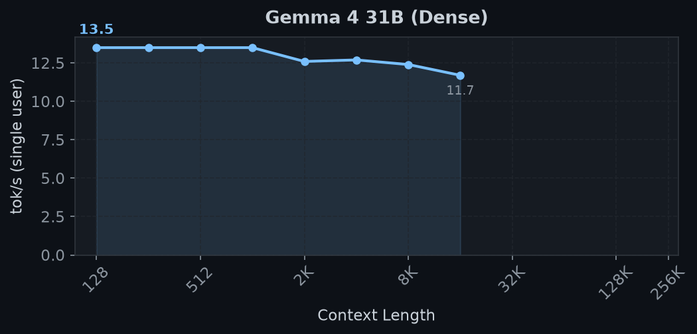

<div align="center">

# M4 Pro Inference: SGLang + MLX

**256K context LLM inference on Apple Silicon**

SGLang with native MLX backend on M4 Pro (64GB unified memory)

[](https://github.com/ml-explore/mlx)
[](https://github.com/sgl-project/sglang)
[](https://python.org)
[](LICENSE)

</div>

---

## Current Focus (2026-04-18)

**Primary target: single-user 256K context on agentic workloads** — multi-user
throughput is secondary. Decode TPOT at long context > peak batch throughput.

**Hard constraint: every new model must pass `validate_capabilities.py`** before
its numbers land in this README. The 3090 and R9700 sister teams found *multiple*
silent quality regressions in checkpoints that pass MMLU/HumanEval but emit
`<unk>`, infinite `<think>` loops, or `<pad>` tokens. We adopt the same gate.

### Active work (updated 2026-04-18 evening — major items DONE)

1. **Quality eval parity with sister repos — DONE.** Ported
   `validate_capabilities.py`, `validate_chat_template.py`, `eval_and_chart.py`
   (MMLU + HumanEval + LAB-Bench + Needle), `run_all_evals.sh`, `test_thinking.sh`,
   `test_radix_cache_repeat.py`, `bench_smoke.sh` (smoke-tested PASS on
   coder-30b + devstral). **6-model quality table** published in
   `benchmarks/quality/` with chart.
2. **Qwen3 family thinking under greedy MLX — DONE.** Confirmed infinite
   `<think>` loop. `--no-thinking` added to validators / eval scripts.
3. **MLX vision end-to-end — DONE for Devstral.** Patches 007/010/011/012 +
   VLM detection take an image from the OpenAI-format request all the way
   into `mlx_vlm`'s vision encoder. **Devstral-24B describes a synthetic
   red circle perfectly through SGLang.** Qwen3.5 wires up correctly but
   hits the known DeltaNet 4-bit quality issue. Gemma 4 + Qwen3.6 are
   architecturally VLMs but mlx-community 4bit checkpoints are missing
   `preprocessor_config.json` (text-only on those for now).
4. **DeltaNet hybrid quality — FIXED via patch 013 (2026-04-18 evening).**
   Root cause was NOT 4-bit quantization. The bug: when Qwen3.5/3.6 load
   via `mlx_vlm.load` (vision_config in their config.json), the outer
   wrapper has no `make_cache` attribute — `make_cache` lives on
   `language_model`. Our `_acquire_cache` fell through to building uniform
   `ContiguousKVCache` for every layer, giving DeltaNet's 24 hybrid layers
   the wrong cache type and producing fluent garbage tokens. Fix routes
   the hybrid cache via `model.language_model.make_cache()` and resets
   ArraysCache state on pool reuse. Both 4-bit Qwen3.5-27B and
   Qwen3.5-9B-MLX-8bit now produce correct factual answers. **Old MMLU
   numbers (16.7-33.3%) are stale — needs re-measurement.**
5. **256K bench coverage — open.** Coder-30B and Devstral fully
   characterized in old benchmarks; need to backfill remaining models.

### Open work (each is a multi-hour project)
- Per-request DeltaNet `conv_state`/`ssm_state` plumbing in `caches[i]` —
  proper fix for Qwen3.5/Coder-Next batched decode (current patch 008 is
  serial-decode fallback that limits MAX_RUNNING=1; correctness now fine,
  throughput is the only remaining concern).
- Re-measure MMLU on Qwen3.5/Coder-Next after patch 013 cache fix —
  prior 16.7-33.3% numbers are stale.
- SGLang multimodal processor compat for Idefics3/SmolVLM (or custom
  processor that bypasses `transformers_auto`).
- Root-cause patch 001 scatter-write corruption (MLX-level lazy-graph
  aliasing — works in REPL, fails in production server context).

## Cross-team collaboration

We share findings with two sister repos on the same SGLang stack:
- **3090 team** — `~/AI/2x-3090-GA102-300-A1-sglang-inference` (NVIDIA Ampere,
  AWQ_Marlin, 14 patches, hits 256K @ 74 tok/s on REAM-30B)
- **R9700 team** — `~/AI/2x-R9700-RDNA4-GFX1201-sglang-inference` (AMD RDNA4,
  ROCm 7.2, 14 patches, hits 256K @ 13 tok/s on Qwen3.6-35B-A3B)

Their kernel patches don't port directly (Marlin/HIP-specific), but their **eval
harnesses, calibration insights, and chat-template fixes are portable** — the
quality eval suite under `scripts/eval/` is a direct adoption.

## Known Issues

- **Radix cache (patch 001) corrupts repeated prompts** *(found 2026-04-18 by `validate_capabilities.py`)*.
  When the *exact same prompt* is sent twice (cache-hit on the full prefix), the
  2nd+ response is deterministic garbage unrelated to the prompt. First request
  after `POST /flush_cache` is correct, then identical prompts re-trigger the bug.
  All-different prompts are fine. **Workaround: launch with
  `EXTRA_ARGS="--disable-radix-cache" bash scripts/launch.sh <preset>`**, which
  is now the default in `scripts/eval/run_all_evals.sh` and `test_thinking.sh`.
  Untreated, this silently invalidates every multi-turn agentic workload and
  every quality benchmark from request 2 onward.
- **Greedy-only sampling on MLX backend** — `mx.argmax` is the only sampler.
  Temperature/top-p/top-k unsupported. Combined with Qwen3-family templates that
  embed `<think>` markers regardless of `enable_thinking`, this is a known risk
  for `</think>\nX\n</think>…` repetition loops. `validate_capabilities.py`
  includes a loop-detector for this signature.
- **Qwen3.5-27B / Qwen3-30B-MoE / Qwen3-32B enter infinite `<think>` loops**
  *(confirmed 2026-04-18 via validator)*. The "ball and bat" reasoning prompt
  hits `max_tokens=2048` with `finish_reason=length`, generating an open-ended
  reasoning chain that never closes. Short factual prompts still return cleanly.
  Root cause: greedy decode + chat template that always emits `<think>`. Fix
  is blocked on MLX backend gaining real sampling support.
- **MLX vision works in mlx_vlm but crashes in the SGLang MLX bridge**
  *(updated 2026-04-18 evening)*. Direct test:
  `mlx_vlm.load("ds4sd/SmolDocling-256M-preview-mlx-bf16") + generate(...)`
  on a synthetic image runs without GPU crash. So MLX itself is fine — the
  crashes the user reported are in our **SGLang MLX bridge**, specifically
  in the image-processor / tensor-handoff path. Patch 002 disables
  multimodal as a workaround. Re-enabling and patching the bridge is the
  open investigation (see Active work #3).
- **VLM warmup crash on Devstral** — Devstral-24B is detected as VLM and crashes
  during warmup; we set `--skip-server-warmup` automatically in the preset.
- **HDMI display blackout** — brief screen blank when server starts heavy Metal
  compute (M4 Pro HDMI quirk, not an SGLang bug).

---

## Highlights

- **256K context** on 64GB Mac with FP8 quantized KV cache
- **107 tok/s** peak throughput (Coder-30B MoE, 8 concurrent)
- **68 tok/s** single-user decode (MoE models)
- **7 models** supported, including DeltaNet hybrids
- **Automatic RoPE scaling** extends models beyond native context limits

## Performance

> Mac mini M4 Pro (64GB), SGLang + MLX, `sglang.bench_serving`
>
> **Context sweep**: single user, 64 output tokens, radix cache disabled, FP8 or TurboQuant KV cache. Measures decode speed (TPOT) and prefill time (TTFT) at each context length up to 256K.
>
> **Concurrency sweep**: 256 in / 256 out, 8K context, scaling concurrent users. Run separately with smaller KV pool to leave room for batching.

### Decode Speed vs Context Length

<div align="center">

</div>

### 256K Context Results

| Model | Type | Weights | tok/s @128 | tok/s @64K | tok/s @256K | KV Pool |
|:------|:-----|:-------:|:----------:|:----------:|:-----------:|:-------:|
| **Coder-Next 80B** | MoE+DeltaNet | 42 GB | 55.7 | **18.3** | 64K max | 81K slots |
| **Qwen3.5-27B** | DeltaNet | 15 GB | 14.3 | 6.1 | **3.9** | 51% |
| **Coder-30B** | MoE (3B active) | 16 GB | 68.4 | 6.3 | **3.2** | 20% |
| **Devstral-24B** | Dense | 14 GB | 17.0 | 3.4 | **1.8** | 30% |
| **Gemma 4 26B** | MoE (4B active) | 15 GB | 58.8 | 3.0 | **1.5** | 48% |

### Throughput Scaling

<div align="center">

</div>

| Model | 1 user | 2 users | 4 users | 8 users |
|:------|:------:|:-------:|:-------:|:-------:|
| **Coder-30B** (MoE) | 82.6 | 89.6 | 97.1 | **107.4** |
| **Devstral-24B** (Dense) | 27.0 | 26.8 | 30.4 | 39.2 |

*tok/s total output throughput at 256 in / 256 out. Other models pending concurrency benchmarks.*

<details>
<summary><b>Coder-30B MoE — best for 256K agentic use</b></summary>

<div align="center">


</div>

| Context | TPOT (ms) | tok/s | TTFT |
|:-------:|:---------:|:-----:|:----:|
| 128 | 14.6 | 68.4 | 0.2s |
| 1K | 14.6 | 68.7 | 0.2s |
| 4K | 18.1 | 55.2 | 1.3s |
| 8K | 28.0 | 35.8 | 7s |
| 16K | 46.4 | 21.6 | 26s |
| 32K | 84.7 | 11.8 | 1.4m |
| 64K | 158.3 | 6.3 | 5.0m |
| 128K | 307.6 | 3.3 | 19.5m |
| **256K** | **309.2** | **3.2** | **19.5m** |

</details>

<details>
<summary><b>Qwen3-30B MoE — same architecture as Coder-30B</b></summary>

<div align="center">

</div>

| Context | TPOT (ms) | tok/s | TTFT |
|:-------:|:---------:|:-----:|:----:|
| 128 | 14.7 | 68.0 | 0.2s |
| 1K | 14.5 | 69.2 | 0.2s |
| 4K | 18.1 | 55.2 | 1.3s |
| 8K | 28.1 | 35.6 | 7s |
| 16K | 46.7 | 21.4 | 26s |
| 32K | 84.7 | 11.8 | 1.4m |
| **64K** | **158.5** | **6.3** | **5.1m** |

RoPE scaled from 40K native → 256K. Matches Coder-30B exactly.

</details>

<details>
<summary><b>Devstral-24B Dense</b></summary>

<div align="center">


</div>

| Context | TPOT (ms) | tok/s | TTFT |
|:-------:|:---------:|:-----:|:----:|
| 128 | 58.7 | 17.0 | 0.5s |
| 1K | 58.6 | 17.1 | 0.5s |
| 4K | 62.1 | 16.1 | 8s |
| 8K | 77.4 | 12.9 | 42s |
| 16K | 108.8 | 9.2 | 1.8m |
| 32K | 169.2 | 5.9 | 4.3m |
| 64K | 295.7 | 3.4 | 10.9m |
| **256K** | **540.9** | **1.8** | **29.3m** |

</details>

<details>
<summary><b>Gemma 4 26B MoE</b></summary>

<div align="center">

</div>

| Context | TPOT (ms) | tok/s | TTFT |
|:-------:|:---------:|:-----:|:----:|
| 128 | 17.0 | 58.8 | 0.2s |
| 1K | 16.8 | 59.5 | 0.2s |
| 4K | 22.1 | 45.4 | 1.6s |
| 8K | 42.2 | 23.7 | 9s |
| 16K | 82.8 | 12.1 | 30s |
| 32K | 165.6 | 6.0 | 1.4m |
| 64K | 333.1 | 3.0 | 4.8m |
| 128K | 672.6 | 1.5 | 17.8m |
| **256K** | **674.9** | **1.5** | **17.7m** |

48% KV pool at 256K — tightest fit of the passing models.

</details>

<details>
<summary><b>Qwen3-32B Dense</b></summary>

<div align="center">

</div>

| Context | TPOT (ms) | tok/s | TTFT |
|:-------:|:---------:|:-----:|:----:|
| 128 | 81.8 | 12.2 | 0.1s |
| 1K | 82.2 | 12.2 | 0.1s |
| 4K | 90.2 | 11.1 | 0.1s |
| **8K** | **121.4** | **8.2** | **0.3s** |

64 layers makes KV cache very large. Needs `--kv-cache turboquant` for 256K. Confirmed working at 32K+ with radix cache disabled.

</details>

<details>
<summary><b>Qwen3.5-27B DeltaNet — fastest at 256K</b></summary>

<div align="center">

</div>

| Context | TPOT (ms) | tok/s | TTFT |
|:-------:|:---------:|:-----:|:----:|
| 128 | 69.8 | 14.3 | 0.6s |
| 1K | 69.5 | 14.4 | 0.6s |
| 4K | 71.6 | 14.0 | 10s |
| 8K | 79.0 | 12.7 | 48s |
| 16K | 90.4 | 11.1 | 2.0m |
| 32K | 112.3 | 8.9 | 4.6m |
| 64K | 162.8 | 6.1 | 11.2m |
| 128K | 256.9 | 3.9 | 28.0m |
| **256K** | **256.7** | **3.9** | **27.8m** |

DeltaNet O(1) layers keep TPOT remarkably flat. Fastest decode at 128K+ of all models. 51% pool at 256K. RoPE scaled from 40K native.

</details>

<details>
<summary><b>Coder-Next 80B MoE+DeltaNet — fastest at 64K</b></summary>

<div align="center">

</div>

| Context | TPOT (ms) | tok/s | TTFT |
|:-------:|:---------:|:-----:|:----:|
| 128 | 18.3 | 54.6 | 0.2s |
| 1K | 17.9 | 55.7 | 0.2s |
| 4K | 18.9 | 52.9 | 1.6s |
| 8K | 21.5 | 46.5 | 8s |
| 16K | 26.4 | 37.8 | 23s |
| 32K | 35.8 | 28.0 | 58s |
| **64K** | **54.7** | **18.3** | **2.6m** |

An 80B model doing 18.3 tok/s at 64K — faster than Devstral-24B at *any* context. MoE+DeltaNet hybrid compounds both advantages. 81K pool limits context to 64K on 64 GB (42 GB weights).

</details>

<details>
<summary><b>Gemma 4 31B Dense</b></summary>

<div align="center">

</div>

| Context | TPOT (ms) | tok/s | TTFT |
|:-------:|:---------:|:-----:|:----:|
| 128 | 80.1 | 12.5 | 0.7s |
| 1K | 80.1 | 12.5 | 0.7s |
| 4K | 99.0 | 10.1 | 12s |
| 8K | 181.1 | 5.5 | 60s |
| **16K** | **347.7** | **2.9** | **2.8m** |

Very large KV heads (506K bytes/slot). Needs turboquant for anything beyond 16K.

</details>

---

## Quick Start

```bash
# Install
./scripts/setup.sh

# Run a model (FP8 KV cache + radix cache enabled by default)
./scripts/launch.sh coder-30b

# 256K context (FP8 KV + radix cache + RoPE scaling all automatic)
./scripts/launch.sh coder-30b --context-length 262144

# TurboQuant for models with large KV heads
./scripts/launch.sh gemma4-31b --context-length 262144 --kv-cache turboquant

# Full precision if needed
./scripts/launch.sh devstral --kv-cache fp16
```

## Supported Models

| Model | Type | Weights | 1-user tok/s | Max Context | Launch |
|:------|:-----|:-------:|:------------:|:-----------:|:-------|
| Coder-Next 80B | MoE+DeltaNet | 42 GB | 55.7 | **64K** (18.3 tok/s) | `launch.sh coder-next` |
| Coder-30B | MoE (3B active) | 16 GB | 68.4 | **256K** (3.2 tok/s) | `launch.sh coder-30b` |
| Qwen3-30B | MoE (3B active) | 16 GB | 69.0 | **64K** (6.3 tok/s) | `launch.sh qwen3-moe` |
| Gemma 4 26B | MoE (4B active) | 15 GB | 58.8 | **256K** (1.5 tok/s) | `launch.sh gemma4` |
| Qwen3.5-27B | DeltaNet hybrid | 15 GB | 14.3 | **256K** (3.9 tok/s) | `launch.sh qwen35` |
| Devstral-24B | Dense | 14 GB | 17.0 | **256K** (1.8 tok/s) | `launch.sh devstral` |
| Qwen3-32B | Dense (turboquant) | 18 GB | 12.1 | 16K (bench timeout) | `launch.sh qwen3-32b` |
| Gemma 4 31B | Dense (turboquant) | 17 GB | 12.5 | 16K | `launch.sh gemma4-31b` |

All models 4-bit MLX quantized from [`mlx-community/`](https://huggingface.co/mlx-community) on HuggingFace.

### Choosing a Model

**For agentic / long-context workloads** — use MoE models. They read far fewer weights per token (3-4B active vs 24-32B total), giving 4x faster decode at short context and 2x faster at 256K. Coder-30B is the best overall: fastest decode, lowest KV pool usage, highest concurrent throughput.

**Why MoE wins at long context:**
Each decode token must (1) read model weights and (2) read the entire KV cache for attention. At short context, weight loading dominates — MoE reads 1.5 GB vs Dense reading 14 GB, hence 4x faster. At long context, KV cache read grows linearly with context length (O(n) attention). At 256K with fp8, the KV read is ~5-10 GB — comparable to model weights. MoE models keep the weight component small, so the KV overhead is proportionally less painful.

**For quality-sensitive workloads** — dense models (Devstral-24B, Qwen3-32B) may produce better outputs since all parameters participate in every token, but they are significantly slower at long context.

**DeltaNet hybrids** (Qwen3.5, Coder-Next) — these alternate standard attention layers (O(n) per token) with linear attention layers (O(1) per token). The linear layers don't slow down with context at all, making them architecturally suited for very long context. However, they're currently limited by the standard attention layers that still have O(n) cost.

### Context Length vs Decode Speed: Why It Degrades

Every generated token must attend to **all previous tokens** across every layer — this is O(n) in both memory bandwidth and compute:

| Context | KV Read (fp8) | Weight Read (MoE) | Weight Read (Dense) | Bottleneck |
|:-------:|:-------------:|:-----------------:|:-------------------:|:-----------|
| 128 | 2.6 MB | 1.5 GB | 14 GB | Weights |
| 32K | 655 MB | 1.5 GB | 14 GB | Weights |
| 128K | 2.6 GB | 1.5 GB | 14 GB | **KV cache** (MoE) |
| 256K | 5.2 GB | 1.5 GB | 14 GB | **KV cache** |

At 256K, the KV cache read per decode token is **3.5x the MoE weight read** — this is why decode slows from 68 tok/s to 3.2 tok/s. The M4 Pro's 273 GB/s memory bandwidth is shared between weights and KV, and the O(n) attention compute also becomes significant.

> [!TIP]
> [Research shows](https://github.com/ml-explore/mlx/discussions/3134) that 4-bit KV quantization (our TurboQuant) can actually be **faster** than unquantized on M4 Pro — less memory traffic outweighs the dequantization cost.

### Prefix Caching (Radix Cache)

For agentic workloads, the same system prompt and conversation history are sent with every request. Without caching, the server re-prefills the entire context from scratch each turn — at 256K, that's a **20-30 minute prefill every request**.

SGLang's radix cache (our patch 001) reuses KV cache from shared prefixes. On cache hit, only new tokens need prefilling:

Radix cache is **enabled by default**. Combined with FP8 KV cache (also default), subsequent turns in a conversation skip redundant prefill entirely.

| Scenario | Without Cache | With Radix Cache |
|:---------|:------------:|:----------------:|
| First request (256K) | ~20 min | ~20 min |
| Follow-up (same prefix + 100 new tokens) | ~20 min | **< 1 sec** |

---

## 256K Context: How It Works

Three features enable 256K context on 64GB Apple Silicon:

### FP8 / TurboQuant KV Cache

```bash
--kv-cache fp8          # MXFP8 quantized, ~2x memory savings
--kv-cache turboquant   # Affine 4-bit, ~3.5x memory savings
```

| Mode | Bytes/elem | Savings | Use case |
|:-----|:----------:|:-------:|:---------|
| **fp8** (default) | 1.03 | **1.9x** | Most models, best speed/memory tradeoff |
| **turboquant** | 0.56 | **3.6x** | Models with large KV heads (Gemma 4 31B) |
| fp16 | 2.0 | 1x | Debugging, quality testing |

### Health Check Timeout

SGLang's default 20s health check is too short for chunked prefill at 64K+ context (each 4K chunk takes 50-80s on Apple Silicon). Set automatically:

```bash
export SGLANG_HEALTH_CHECK_TIMEOUT=120  # in common.sh
```

### Automatic RoPE Scaling

Models with native context < requested context get automatic linear RoPE interpolation:

```
RoPE scaling: context_length=262144 > max_position_embeddings=40960,
applying linear scale=0.1562 (factor=6.40)
Patched 48 RoPE modules
```

### Memory Budget at 256K (64 GB Mac)

The radix cache pre-allocates the full KV pool at startup. On Apple Silicon's unified memory, this competes with Metal compute buffers. Use `--mem-fraction-static 0.7` (default) to leave headroom.

| Model | Weights | KV @256K (fp8) | Total | Headroom | Fits? |
|:------|:-------:|:--------------:|:-----:|:--------:|:------|
| Coder-30B (MoE) | 16 GB | 12.4 GB | 28 GB | 24 GB | **fp8** |
| Qwen3-30B (MoE) | 16 GB | 12.4 GB | 28 GB | 24 GB | **fp8** |
| Devstral-24B | 14 GB | 20.6 GB | 35 GB | 17 GB | **fp8** |
| Gemma 4 26B (MoE) | 15 GB | 30.9 GB | 46 GB | 6 GB | **fp8** (tight) |
| Qwen3-32B | 18 GB | 33.0 GB | 51 GB | 1 GB | **turboquant** needed |
| Coder-Next 80B | 42 GB | — | — | — | No (weights alone) |

> [!IMPORTANT]
> Qwen3-32B and Gemma 4 31B need `--kv-cache turboquant` at 256K — fp8 KV doesn't leave enough headroom for Metal compute on 64 GB. TurboQuant (4-bit KV) halves KV memory: Qwen3-32B goes from 33 GB → 18 GB KV, leaving 16 GB headroom.

```bash
# Models that fit at 256K with fp8 (default)
./scripts/launch.sh coder-30b --context-length 262144

# Models that need turboquant at 256K
./scripts/launch.sh qwen3-32b --context-length 262144 --kv-cache turboquant
```

---

> [!NOTE]
> Full known-issues list lives at the top of this README, under [Known Issues](#known-issues).

## Patches

5 patches on top of SGLang `main` at `1f8df9705`:

| Patch | Purpose |
|:------|:--------|
| **001** | Radix cache + KV pool for MLX |
| **002** | Disable CUDA graph, force torch_native attention on MPS |
| **003** | Skip quantization verification for MLX models |
| **004** | Request lifecycle + DeltaNet/Mamba hybrid support |
| **005** | Attention wrapper fix for Devstral varargs |

## Setup

```bash
./scripts/setup.sh
```

<details>
<summary><b>Component versions</b></summary>

| Component | Version |
|:----------|:--------|
| SGLang | main + 5 patches |
| MLX | 0.31.1 |
| mlx-lm | 0.31.2 |
| PyTorch | 2.9.1 (MPS) |
| Python | 3.12 |

</details>

<details>
<summary><b>Manual setup</b></summary>

```bash
python3 -m venv .venv && source .venv/bin/activate
git clone https://github.com/sgl-project/sglang.git components/sglang
cd components/sglang && git checkout 1f8df9705
for p in ../../patches/*.patch; do git apply "$p"; done
cd python && cp pyproject_other.toml pyproject.toml
pip install -e ".[srt_mps]"
```

</details>

### Quantization

MLX uses its own quantization format. Pre-quantized models from [`mlx-community/`](https://huggingface.co/mlx-community), or convert:

```bash
python -m mlx_lm.convert --hf-path <model> --mlx-path <output> -q --q-bits 4
```

> [!WARNING]
> AWQ/GPTQ models from CUDA/ROCm are **not compatible** — MLX requires its own format.

## Test System

```
Mac mini (Mac16,11)
Apple M4 Pro — 14-core CPU, 20-core GPU
64 GB unified memory (LPDDR5, ~273 GB/s)
macOS 26.2
```
