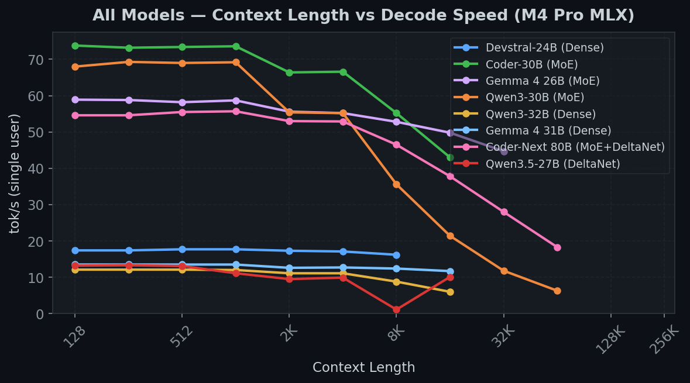
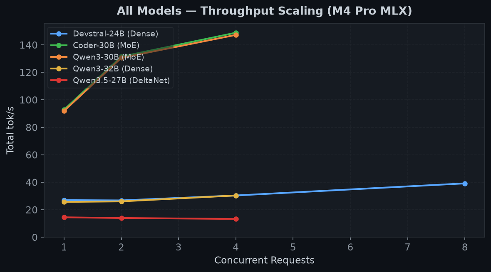

<div align="center">

# M4 Pro Inference: SGLang + MLX

**256K context LLM inference on Apple Silicon**

SGLang with native MLX backend on M4 Pro (64GB unified memory)

[](https://github.com/ml-explore/mlx)
[](https://github.com/sgl-project/sglang)
[](https://python.org)
[](LICENSE)

</div>

---

## Highlights

- **256K context** on 64GB Mac with FP8 quantized KV cache
- **107 tok/s** peak throughput (Coder-30B MoE, 8 concurrent)
- **68 tok/s** single-user decode (MoE models)
- **7 models** supported, including DeltaNet hybrids
- **Automatic RoPE scaling** extends models beyond native context limits

## Performance

> All benchmarks on Mac mini M4 Pro (64GB), SGLang + MLX, FP8 KV cache

### Decode Speed vs Context Length

<div align="center">

</div>

### 256K Context Results

| Model | Type | Weights | tok/s @128 | tok/s @256K | TTFT @256K | KV Pool |
|:------|:-----|:-------:|:----------:|:-----------:|:----------:|:-------:|
| **Coder-30B** | MoE (3B active) | 16 GB | 68.4 | 3.2 | 19.5m | 20% |
| **Devstral-24B** | Dense | 14 GB | 17.0 | 1.8 | 29.3m | 30% |
| **Gemma 4 26B** | MoE (4B active) | 15 GB | 58.8 | 1.5 | 17.7m | 48% |

### Throughput Scaling

<div align="center">

</div>

| Model | 1 user | 4 users | 8 users |
|:------|:------:|:-------:|:-------:|
| **Coder-30B** | 82.6 tok/s | 97.1 tok/s | **107.4 tok/s** |
| **Devstral-24B** | 27.0 tok/s | 30.4 tok/s | 39.2 tok/s |

<details>
<summary><b>Full context sweep tables</b></summary>

#### Coder-30B MoE (best for 256K agentic use)

| Context | TPOT (ms) | tok/s | TTFT |
|:-------:|:---------:|:-----:|:----:|
| 128 | 14.6 | 68.4 | 0.2s |
| 1K | 14.6 | 68.7 | 0.2s |
| 4K | 18.1 | 55.2 | 1.3s |
| 8K | 28.0 | 35.8 | 7s |
| 16K | 46.4 | 21.6 | 26s |
| 32K | 84.7 | 11.8 | 1.4m |
| 64K | 158.3 | 6.3 | 5.0m |
| 128K | 307.6 | 3.3 | 19.5m |
| **256K** | **309.2** | **3.2** | **19.5m** |

#### Devstral-24B Dense

| Context | TPOT (ms) | tok/s | TTFT |
|:-------:|:---------:|:-----:|:----:|
| 128 | 58.7 | 17.0 | 0.5s |
| 1K | 58.6 | 17.1 | 0.5s |
| 4K | 62.1 | 16.1 | 8s |
| 8K | 77.4 | 12.9 | 42s |
| 16K | 108.8 | 9.2 | 1.8m |
| 32K | 169.2 | 5.9 | 4.3m |
| 64K | 295.7 | 3.4 | 10.9m |
| **256K** | **540.9** | **1.8** | **29.3m** |

#### Gemma 4 26B MoE

| Context | TPOT (ms) | tok/s | TTFT |
|:-------:|:---------:|:-----:|:----:|
| 128 | 17.0 | 58.8 | 0.2s |
| 1K | 16.8 | 59.5 | 0.2s |
| 4K | 22.1 | 45.4 | 1.6s |
| 8K | 42.2 | 23.7 | 9s |
| 16K | 82.8 | 12.1 | 30s |
| 32K | 165.6 | 6.0 | 1.4m |
| 64K | 333.1 | 3.0 | 4.8m |
| 128K | 672.6 | 1.5 | 17.8m |
| **256K** | **674.9** | **1.5** | **17.7m** |

</details>

---

## Quick Start

```bash
# Install
./scripts/setup.sh

# Run a model (FP8 KV cache + radix cache enabled by default)
./scripts/launch.sh coder-30b

# 256K context (FP8 KV + radix cache + RoPE scaling all automatic)
./scripts/launch.sh coder-30b --context-length 262144

# TurboQuant for models with large KV heads
./scripts/launch.sh gemma4-31b --context-length 262144 --kv-cache turboquant

# Full precision if needed
./scripts/launch.sh devstral --kv-cache fp16
```

## Supported Models

| Model | Type | Weights | 1-user tok/s | 256K | Launch |
|:------|:-----|:-------:|:------------:|:----:|:-------|
| Coder-30B | MoE (3B active) | 16 GB | 68.4 | 3.2 | `launch.sh coder-30b` |
| Qwen3-30B | MoE (3B active) | 16 GB | ~68 | pending | `launch.sh qwen3-moe` |
| Gemma 4 26B | MoE (4B active) | 15 GB | 58.8 | 1.5 | `launch.sh gemma4` |
| Coder-Next 80B | MoE+DeltaNet | 42 GB | 55.3 | mem limited | `launch.sh coder-next` |
| Devstral-24B | Dense | 14 GB | 17.0 | 1.8 | `launch.sh devstral` |
| Qwen3.5-27B | DeltaNet hybrid | 15 GB | 14.5 | pending | `launch.sh qwen35` |
| Qwen3-32B | Dense | 18 GB | ~12 | pending | `launch.sh qwen3-32b` |
| Gemma 4 31B | Dense | 17 GB | 12.5 | 16K max | `launch.sh gemma4-31b` |

All models 4-bit MLX quantized from [`mlx-community/`](https://huggingface.co/mlx-community) on HuggingFace.

### Choosing a Model

**For agentic / long-context workloads** — use MoE models. They read far fewer weights per token (3-4B active vs 24-32B total), giving 4x faster decode at short context and 2x faster at 256K. Coder-30B is the best overall: fastest decode, lowest KV pool usage, highest concurrent throughput.

**Why MoE wins at long context:**
Each decode token must (1) read model weights and (2) read the entire KV cache for attention. At short context, weight loading dominates — MoE reads 1.5 GB vs Dense reading 14 GB, hence 4x faster. At long context, KV cache read grows linearly with context length (O(n) attention). At 256K with fp8, the KV read is ~5-10 GB — comparable to model weights. MoE models keep the weight component small, so the KV overhead is proportionally less painful.

**For quality-sensitive workloads** — dense models (Devstral-24B, Qwen3-32B) may produce better outputs since all parameters participate in every token, but they are significantly slower at long context.

**DeltaNet hybrids** (Qwen3.5, Coder-Next) — these alternate standard attention layers (O(n) per token) with linear attention layers (O(1) per token). The linear layers don't slow down with context at all, making them architecturally suited for very long context. However, they're currently limited by the standard attention layers that still have O(n) cost.

### Context Length vs Decode Speed: Why It Degrades

Every generated token must attend to **all previous tokens** across every layer — this is O(n) in both memory bandwidth and compute:

| Context | KV Read (fp8) | Weight Read (MoE) | Weight Read (Dense) | Bottleneck |
|:-------:|:-------------:|:-----------------:|:-------------------:|:-----------|
| 128 | 2.6 MB | 1.5 GB | 14 GB | Weights |
| 32K | 655 MB | 1.5 GB | 14 GB | Weights |
| 128K | 2.6 GB | 1.5 GB | 14 GB | **KV cache** (MoE) |
| 256K | 5.2 GB | 1.5 GB | 14 GB | **KV cache** |

At 256K, the KV cache read per decode token is **3.5x the MoE weight read** — this is why decode slows from 68 tok/s to 3.2 tok/s. The M4 Pro's 273 GB/s memory bandwidth is shared between weights and KV, and the O(n) attention compute also becomes significant.

> [!TIP]
> [Research shows](https://github.com/ml-explore/mlx/discussions/3134) that 4-bit KV quantization (our TurboQuant) can actually be **faster** than unquantized on M4 Pro — less memory traffic outweighs the dequantization cost.

### Prefix Caching (Radix Cache)

For agentic workloads, the same system prompt and conversation history are sent with every request. Without caching, the server re-prefills the entire context from scratch each turn — at 256K, that's a **20-30 minute prefill every request**.

SGLang's radix cache (our patch 001) reuses KV cache from shared prefixes. On cache hit, only new tokens need prefilling:

Radix cache is **enabled by default**. Combined with FP8 KV cache (also default), subsequent turns in a conversation skip redundant prefill entirely.

| Scenario | Without Cache | With Radix Cache |
|:---------|:------------:|:----------------:|
| First request (256K) | ~20 min | ~20 min |
| Follow-up (same prefix + 100 new tokens) | ~20 min | **< 1 sec** |

---

## 256K Context: How It Works

Three features enable 256K context on 64GB Apple Silicon:

### FP8 / TurboQuant KV Cache

```bash
--kv-cache fp8          # MXFP8 quantized, ~2x memory savings
--kv-cache turboquant   # Affine 4-bit, ~3.5x memory savings
```

| Mode | Bytes/elem | Savings | Use case |
|:-----|:----------:|:-------:|:---------|
| **fp8** (default) | 1.03 | **1.9x** | Most models, best speed/memory tradeoff |
| **turboquant** | 0.56 | **3.6x** | Models with large KV heads (Gemma 4 31B) |
| fp16 | 2.0 | 1x | Debugging, quality testing |

### Health Check Timeout

SGLang's default 20s health check is too short for chunked prefill at 64K+ context (each 4K chunk takes 50-80s on Apple Silicon). Set automatically:

```bash
export SGLANG_HEALTH_CHECK_TIMEOUT=120  # in common.sh
```

### Automatic RoPE Scaling

Models with native context < requested context get automatic linear RoPE interpolation:

```
RoPE scaling: context_length=262144 > max_position_embeddings=40960,
applying linear scale=0.1562 (factor=6.40)
Patched 48 RoPE modules
```

### Memory Budget (FP8 KV)

| Model | Weights | KV Pool | 256K Usage | Fits 64GB |
|:------|:-------:|:-------:|:----------:|:---------:|
| Coder-30B (MoE) | 16 GB | 627K slots | 20% | Yes |
| Devstral-24B | 14 GB | 423K slots | 30% | Yes |
| Gemma 4 26B (MoE) | 15 GB | 268K slots | 48% | Yes |
| Coder-Next 80B | 42 GB | 82K slots | — | No (weights) |

---

## Known Issues

> [!NOTE]
> - **Greedy sampling only** — MLX backend uses `mx.argmax`; temperature/top-p not yet supported
> - **VLM warmup crash** — Devstral detected as VLM; use `--skip-server-warmup` (set automatically)
> - **HDMI display blackout** — Brief screen blank when server starts heavy Metal compute (M4 Pro HDMI issue)

## Patches

5 patches on top of SGLang `main` at `1f8df9705`:

| Patch | Purpose |
|:------|:--------|
| **001** | Radix cache + KV pool for MLX |
| **002** | Disable CUDA graph, force torch_native attention on MPS |
| **003** | Skip quantization verification for MLX models |
| **004** | Request lifecycle + DeltaNet/Mamba hybrid support |
| **005** | Attention wrapper fix for Devstral varargs |

## Setup

```bash
./scripts/setup.sh
```

<details>
<summary><b>Component versions</b></summary>

| Component | Version |
|:----------|:--------|
| SGLang | main + 5 patches |
| MLX | 0.31.1 |
| mlx-lm | 0.31.2 |
| PyTorch | 2.9.1 (MPS) |
| Python | 3.12 |

</details>

<details>
<summary><b>Manual setup</b></summary>

```bash
python3 -m venv .venv && source .venv/bin/activate
git clone https://github.com/sgl-project/sglang.git components/sglang
cd components/sglang && git checkout 1f8df9705
for p in ../../patches/*.patch; do git apply "$p"; done
cd python && cp pyproject_other.toml pyproject.toml
pip install -e ".[srt_mps]"
```

</details>

### Quantization

MLX uses its own quantization format. Pre-quantized models from [`mlx-community/`](https://huggingface.co/mlx-community), or convert:

```bash
python -m mlx_lm.convert --hf-path <model> --mlx-path <output> -q --q-bits 4
```

> [!WARNING]
> AWQ/GPTQ models from CUDA/ROCm are **not compatible** — MLX requires its own format.

## Test System

```
Mac mini (Mac16,11)
Apple M4 Pro — 14-core CPU, 20-core GPU
64 GB unified memory (LPDDR5, ~273 GB/s)
macOS 26.2
```
